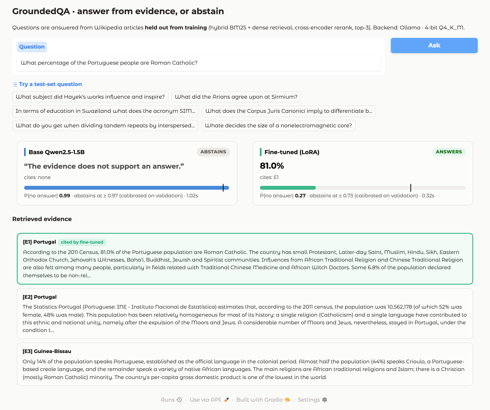
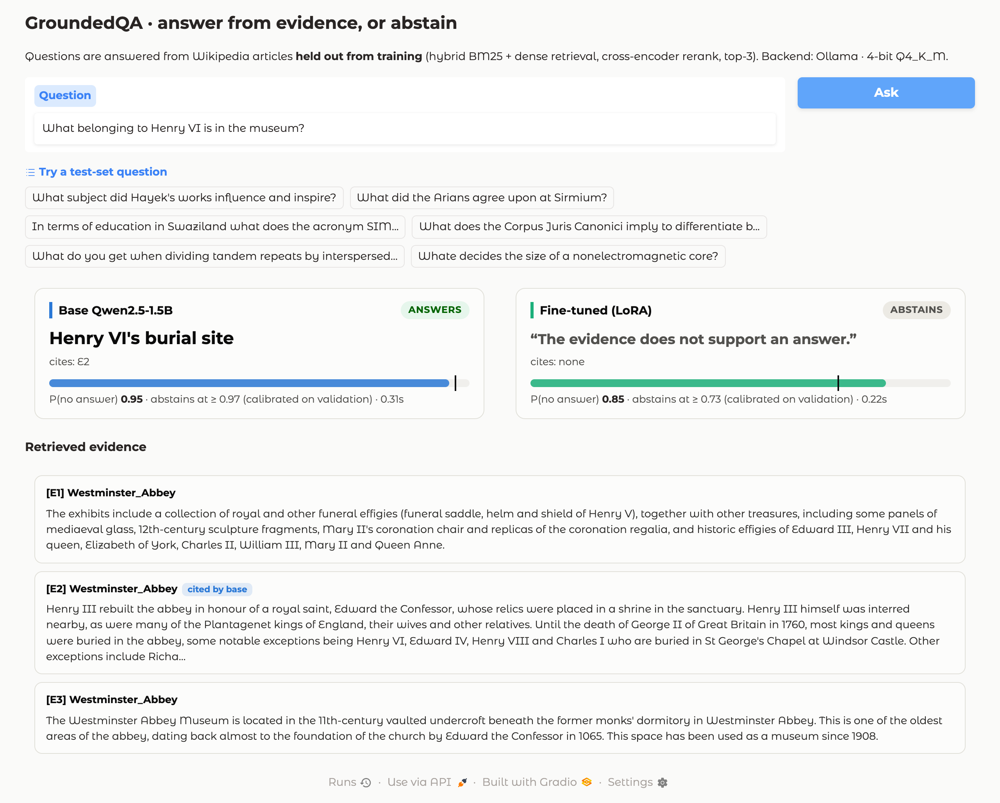
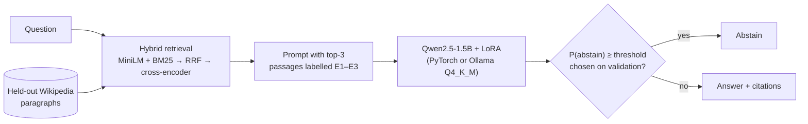

<div align="center">

# GroundedQA

**Retrieval-grounded question answering that knows when to say "I don't know".**

[](https://github.com/njbabani/peft-ollama/actions/workflows/ci.yml)
[](LICENSE)
[](https://www.python.org/)
[](https://github.com/astral-sh/uv)
[](https://github.com/astral-sh/ruff)
<br>
[](https://pytorch.org/)
[](https://github.com/huggingface/peft)
[](https://ollama.com/)
[](https://www.gradio.app/)

[Results](#results) · [How it works](#how-it-works) · [Quickstart](#quickstart) · [Project history](docs/history.md)

</div>

GroundedQA fine-tunes Qwen2.5-1.5B-Instruct with LoRA (Hugging Face PEFT) on an M4
MacBook Air. The model answers questions from retrieved Wikipedia passages with
citations, or abstains when the evidence doesn't support an answer. It is evaluated
as a 2×2 ablation (adapter × retrieval) with calibrated abstention and bootstrap
confidence intervals, and served locally as a 4-bit model through Ollama.

<p align="center">
  
  
</p>

## Results

All numbers come from the committed run in [`reports/full/`](reports/full/summary.md):
400 held-out test questions (200 answerable, 200 unanswerable) from Wikipedia
articles never seen in training. Abstention thresholds were chosen on a separate
validation set, and the test set was used once.

| Variant | Token F1 | Answerable F1 | Abstains on unanswerable | Abstention AUROC |
|---|---|---|---|---|
| Base | 0.500 | 0.000 | 100% | 0.488 |
| Base + RAG | 0.489 | 0.072 | 90.5% | 0.553 |
| Adapter | 0.502 | 0.005 | 100% | 0.567 |
| **Adapter + RAG** | **0.652** | **0.473** | **83.0%** | **0.807** |

**What the results show**

- **Fine-tuning taught answerability.** The base model's abstain probability barely
  separates answerable from unanswerable questions (AUROC 0.55 with retrieval). The
  LoRA adapter reaches **0.807**, which is what lets it answer 62% of answerable
  questions while still abstaining on 83% of unanswerable ones.
- **The adapter and retrieval work together.** With retrieval, the adapter adds
  **+0.163 token F1** over the base model (paired 95% CI [+0.109, +0.215]). Without
  retrieval, it simply abstains.
- **Answers are better as well.** Forced to answer every answerable question, the
  adapter scores 0.682 F1 against 0.505 for the base model, with 100% valid JSON. When
  it answers, 88% of its citations point at the passage that contains the gold answer.
- **4-bit costs little.** Quantised to Q4_K_M and served by Ollama, the adapter
  keeps AUROC at 0.794 and token F1 at 0.627, in 0.92 GiB instead of about 3 GB.

<p align="center"></p>

### Retrieval

The retrieval benchmark uses 2,000 answerable test questions over **2,108 chunks
covering every paragraph of the held-out articles**. A chunk counts as relevant when
it contains the annotated answer span.

| Retriever | Recall@1 | Recall@3 | Recall@10 | MRR | Time / query |
|---|---|---|---|---|---|
| Dense (MiniLM, exact cosine) | 0.660 | 0.824 | 0.938 | 0.754 | < 1 ms |
| BM25 | 0.748 | 0.872 | 0.940 | 0.815 | < 1 ms |
| Hybrid (reciprocal rank fusion) | 0.753 | 0.900 | 0.969 | 0.833 | < 1 ms |
| **Hybrid + cross-encoder rerank** | **0.868** | **0.956** | **0.985** | **0.914** | 119 ms |

<details>
<summary><b>More figures</b>: calibration, paired contrasts, quantisation, training</summary>


</details>

## How it works



- **Data.** SQuAD v2 is split 80/10/10 by article title, so no article appears in two
  splits. Questions that duplicate another split's are removed. The retrieval corpus
  for each split is every paragraph of its articles, not just the sampled questions.
- **Training.** LoRA (rank 16, all linear layers, 18.5M parameters, 1.18% of the
  model) in a plain PyTorch loop on Apple-silicon MPS: 2,400 examples, 300 steps,
  checkpoints every 25 steps. The data mixes 1,100 answerable questions, 1,000
  unanswerable ones, and 300 *retrieval misses*: answerable questions whose source
  passage is withheld, checked so that no supplied passage contains the answer.
- **No shortcuts.** Every training example gets the same number of passages, with
  the source passage at a balanced rotating position. A pre-training audit refuses
  to train if the evidence layout alone could predict the label. This is the bug
  that sank an earlier version; see [project history](docs/history.md).
- **Where the loss goes.** Loss is computed on the reply only. The `" true"`/`" false"`
  abstain decision is a single token among about 20, so it is up-weighted 4×.
- **Calibrated abstention.** Evaluation forces the reply to start with
  `{"abstain": false, "answer": "`, so every variant is judged on content rather than
  formatting. One forward pass gives both P(abstain) at the decision token and the
  answer. Each variant's threshold maximises validation F1, as in the official
  SQuAD 2.0 evaluation, and is then applied unchanged to test.
- **Honest statistics.** Every figure carries 95% bootstrap intervals over
  questions. Contrasts are paired per question, and every prediction is saved.

## Quickstart

Requires Python 3.12 and [uv](https://docs.astral.sh/uv/). It runs on Apple-silicon
Macs (MPS), NVIDIA GPUs (CUDA) or CPU.

```bash
git clone https://github.com/njbabani/peft-ollama && cd peft-ollama
uv sync --all-extras
uv run pytest                                        # 30 tests, a few seconds
uv run groundedqa run --config configs/smoke.toml    # every stage end to end, ~15 min
uv run groundedqa run --config configs/full.toml     # the full experiment, ~4 h on an M4 Air
```

A run is resumable: rerun the same command, or resume from a stage with
`--from train` or `--from evaluate`. Training resumes from its latest checkpoint and
evaluation reuses finished variants.

**Serve it with Ollama and try the demo**

```bash
brew install ollama llama.cpp
# Homebrew ships llama-quantize but not the Python converter: clone the matching tag
git clone --depth 1 --branch <brew llama.cpp tag> https://github.com/ggml-org/llama.cpp runs/tools/llama.cpp
ollama serve &                                        # local only, 127.0.0.1:11434
uv run groundedqa export --run-dir runs/full          # merge LoRA → GGUF → Q4_K_M → ollama create
uv run groundedqa evaluate-ollama --run-dir runs/full # same protocol, 4-bit backend
uv run groundedqa demo --run-dir runs/full --ollama   # Gradio at http://127.0.0.1:7860
uv run groundedqa ask --run-dir runs/full "Who designed the Eiffel Tower?"
```

`brew info --json=v2 llama.cpp` shows the tag to clone.

| Command | What it does |
|---|---|
| `prepare` | Pin Hub revisions, split SQuAD v2 by title, chunk and embed every passage |
| `retrieval-bench` | Recall@k, MRR and latency for dense, BM25, hybrid and reranked retrieval |
| `build-training-data` | Retrieval-matched training evidence, plus the shortcut audit |
| `train` | LoRA fine-tuning with checkpoint and resume |
| `evaluate` | Four variants on validation and test; calibration, AUROC, bootstrap |
| `report` | `summary.md` and figures from the saved JSON |
| `export` / `evaluate-ollama` | 4-bit GGUF for Ollama, and the same evaluation on it |
| `demo` / `ask` | Gradio app, or a single question from the command line |

## Repository layout

```
src/groundedqa/     package: data, retrieval, training, inference, metrics, figures, CLI
configs/            smoke.toml (plumbing check) and full.toml (the reported run)
tests/              pytest suite, offline except for a cached tokenizer
reports/full/       the committed run: summary, metrics and figures
docs/               project history, earlier design notes and README assets
scripts/            README screenshot capture
```

## Hardware and cost

| | M4 MacBook Air (10-core GPU, 24 GB) |
|---|---|
| Training | 300 steps / 2,400 examples in about 2.5 h, bf16, peak about 15 GB |
| Evaluation (fp16, PyTorch) | 3,200 generations in about 1 h, batch 16 |
| Evaluation (Q4_K_M, Ollama) | 3,200 generations in 41 min, one at a time |
| Adapter / quantised model | 85 MB / 0.92 GiB |

## Limitations

- **"Unanswerable" is relative to one passage.** SQuAD v2 marks a question
  unanswerable with respect to its source passage only. A retrieved paragraph from
  the same article could occasionally contain an answer.
- **One run, one seed.** Intervals resample questions, not training runs; repeat
  training across seeds before quoting small differences.
- **Not the official leaderboard.** This is a custom title-disjoint split, and
  SQuAD may appear in the base model's pretraining data.

## Background

Before this package existed, the project ran as a Colab notebook through four failed
training runs. The adapter either always abstained or never did, and a diagnostic
eventually showed it had learned to count passages rather than read them.
[`docs/history.md`](docs/history.md) walks through each failure and the design change
it led to.

## License

Code: [Apache-2.0](LICENSE). Data: [SQuAD v2](https://huggingface.co/datasets/rajpurkar/squad_v2)
(CC BY-SA 4.0). Models:
[Qwen2.5-1.5B-Instruct](https://huggingface.co/Qwen/Qwen2.5-1.5B-Instruct),
[all-MiniLM-L6-v2](https://huggingface.co/sentence-transformers/all-MiniLM-L6-v2) and
[ms-marco-MiniLM-L6-v2](https://huggingface.co/cross-encoder/ms-marco-MiniLM-L6-v2),
each under its own model-card license.
