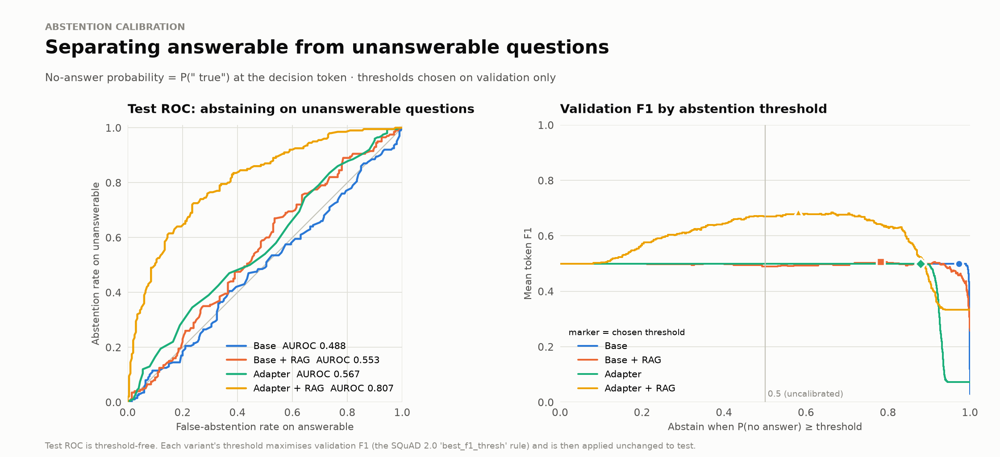
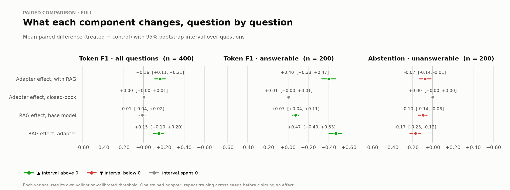
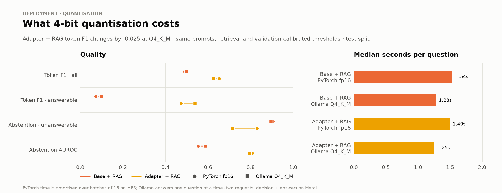
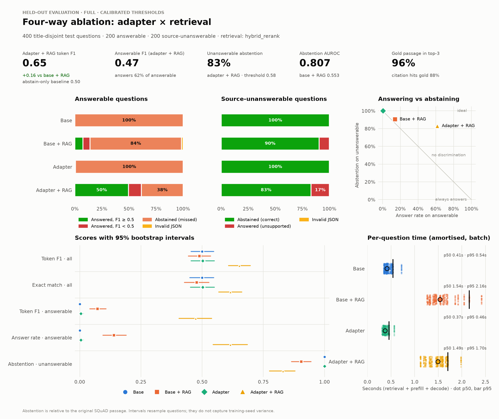
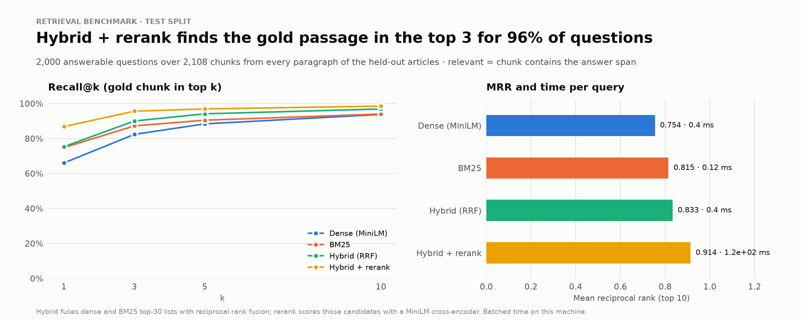
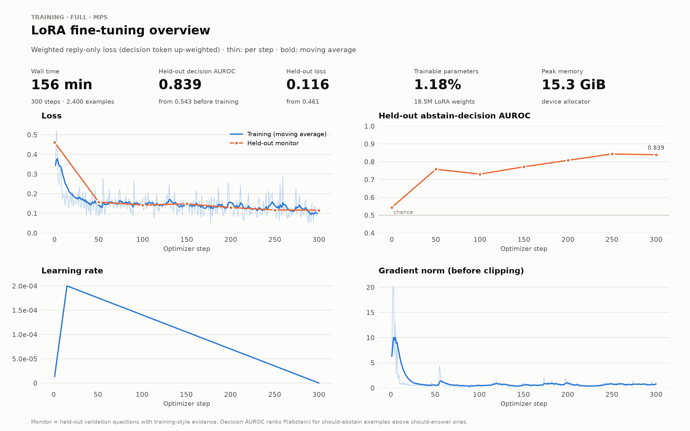
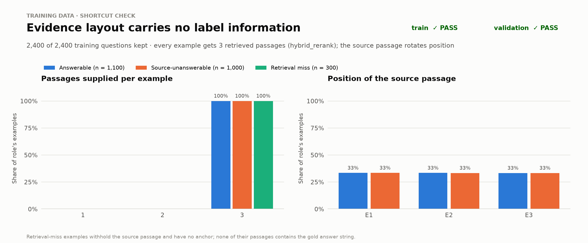

# Run summary: full

- Model: `Qwen/Qwen2.5-1.5B-Instruct` @ `989aa7980e4c`
- Device: `mps` on `macOS-27.0-arm64-arm-64bit`
- Retrieval for QA: `hybrid_rerank`, top-3
- Protocol: custom title-disjoint SQuAD v2; no official benchmark claim

## Data

| Split | Titles | Passages | Chunks | Questions used |
|---|---|---|---|---|
| train | 383 | 16,275 | 17,465 | answerable 1100, retrieval_miss 300, unanswerable 1000 |
| validation | 47 | 1,965 | 2,149 | answerable 200, unanswerable 200 |
| test | 47 | 1,993 | 2,108 | unanswerable 200, answerable 200 |

## Retrieval benchmark

2,000 answerable test questions over 2,108 chunks (every paragraph of the held-out articles).

| Retriever | Recall@1 | Recall@3 | Recall@5 | Recall@10 | MRR | ms / query |
|---|---|---|---|---|---|---|
| Dense (MiniLM, exact cosine) | 0.660 | 0.824 | 0.883 | 0.938 | 0.754 | 0.4 |
| BM25 | 0.748 | 0.872 | 0.904 | 0.940 | 0.815 | 0.12 |
| Hybrid (RRF) | 0.753 | 0.900 | 0.941 | 0.969 | 0.833 | 0.4 |
| Hybrid + cross-encoder rerank | 0.868 | 0.956 | 0.969 | 0.985 | 0.914 | 1.2e+02 |

## Training

- 300 optimizer steps over 2,400 examples in 156.0 min on `mps`
- LoRA parameters: 18,464,768 (1.18%)
- Held-out decision AUROC: 0.543 → 0.839; held-out loss 0.461 → 0.116
- Peak device memory: 15.3 GiB

## Question answering (test, thresholds calibrated on validation)

| Variant | Threshold | Token F1 | EM | Answerable F1 | Answer rate | Abstain (unans.) | AUROC | F1 at 0.5 | Citation hit |
|---|---|---|---|---|---|---|---|---|---|
| Base | 0.973 | 0.500 | 0.500 | 0.000 | 0.000 | 1.000 | 0.488 | 0.500 | n/a |
| Base + RAG | 0.783 | 0.489 | 0.477 | 0.072 | 0.140 | 0.905 | 0.553 | 0.503 | 0.821 |
| Adapter | 0.879 | 0.502 | 0.502 | 0.005 | 0.005 | 1.000 | 0.567 | 0.500 | 0.000 |
| Adapter + RAG | 0.581 | 0.652 | 0.615 | 0.473 | 0.615 | 0.830 | 0.807 | 0.640 | 0.878 |

### Paired contrasts (95% bootstrap intervals)

| Metric | Contrast | Δ | 95% CI |
|---|---|---|---|
| Token F1 · all questions | Adapter effect, with RAG | +0.163 | [+0.109, +0.215] |
| Token F1 · all questions | Adapter effect, closed-book | +0.003 | [+0.000, +0.007] |
| Token F1 · all questions | RAG effect, base model | -0.011 | [-0.039, +0.016] |
| Token F1 · all questions | RAG effect, adapter | +0.149 | [+0.097, +0.200] |
| Token F1 · answerable | Adapter effect, with RAG | +0.401 | [+0.331, +0.471] |
| Token F1 · answerable | Adapter effect, closed-book | +0.005 | [+0.000, +0.015] |
| Token F1 · answerable | RAG effect, base model | +0.072 | [+0.042, +0.106] |
| Token F1 · answerable | RAG effect, adapter | +0.468 | [+0.402, +0.530] |
| Abstention · unanswerable | Adapter effect, with RAG | -0.075 | [-0.135, -0.015] |
| Abstention · unanswerable | Adapter effect, closed-book | +0.000 | [+0.000, +0.000] |
| Abstention · unanswerable | RAG effect, base model | -0.095 | [-0.140, -0.055] |
| Abstention · unanswerable | RAG effect, adapter | -0.170 | [-0.225, -0.120] |

## fp16 (PyTorch) vs 4-bit (Ollama Q4_K_M)

Same prompts, retrieval and validation-calibrated thresholds; test split.

| Variant | Backend | Token F1 | Answerable F1 | Abstain (unans.) | AUROC | p50 s / question |
|---|---|---|---|---|---|---|
| Base + RAG | PyTorch fp16 | 0.489 | 0.072 | 0.905 | 0.553 | 1.54 |
| Base + RAG | Ollama Q4_K_M | 0.497 | 0.099 | 0.895 | 0.589 | 1.28 |
| Adapter + RAG | PyTorch fp16 | 0.652 | 0.473 | 0.830 | 0.807 | 1.49 |
| Adapter + RAG | Ollama Q4_K_M | 0.627 | 0.538 | 0.715 | 0.794 | 1.25 |

## Figures

